# Browser-WASM Dependency Graph

The arrow points from prerequisite to dependent issue. Optional nodes are dashed.

```mermaid
flowchart TD
  subgraph 00_program["Program"]
    n_BWASM_EPIC["BWASM-EPIC<br/>Velqu Browser-WASM runtime program"]
  end
  subgraph 01_design["Architecture and decisions"]
    n_BWASM_D_001["BWASM-D-001<br/>Freeze the Browser-WASM product and runtime contract"]
    n_BWASM_D_002["BWASM-D-002<br/>Produce the wasm32 portability baseline and dependency split map"]
    n_BWASM_D_003["BWASM-D-003<br/>Define the browser execution threat model and isolation contract"]
    n_BWASM_D_004["BWASM-D-004<br/>Ratify support matrix, compatibility claims, and release budgets"]
  end
  subgraph 02_kernel["Portable Rust/WASM kernel"]
    n_BWASM_K_001["BWASM-K-001<br/>Extract a portable runtime model crate"]
    n_BWASM_K_002["BWASM-K-002<br/>Split byte-based QPack core from native loading and tooling"]
    n_BWASM_K_003["BWASM-K-003<br/>Extract a host-independent router core"]
    n_BWASM_K_004["BWASM-K-004<br/>Qualify the schema runtime for wasm32 and expose bounded validation"]
    n_BWASM_K_005["BWASM-K-005<br/>Implement the Rust Browser Kernel and wasm-bindgen ABI"]
    n_BWASM_K_006["BWASM-K-006<br/>Verify and package portable-kernel evidence"]
  end
  subgraph 03_runtime["Browser runtime and Worker execution"]
    n_BWASM_R_001["BWASM-R-001<br/>Create @velqu/browser-runtime package and public runtime contract"]
    n_BWASM_R_002["BWASM-R-002<br/>Implement Fetch-compatible browser dispatcher"]
    n_BWASM_R_003["BWASM-R-003<br/>Define and emit the browser handler-bundle contract"]
    n_BWASM_R_004["BWASM-R-004<br/>Execute handlers in isolated Workers with cancellation and hard recovery"]
    n_BWASM_R_005["BWASM-R-005<br/>Integrate capability registry and Treaty with the browser runtime"]
    n_BWASM_R_006["BWASM-R-006<br/>Verify and package browser-runtime evidence"]
  end
  subgraph 04_build_deploy["Compiler, artifacts, and static deployment"]
    n_BWASM_B_001["BWASM-B-001<br/>Add compiler target browser-wasm"]
    n_BWASM_B_002["BWASM-B-002<br/>Define content-addressed browser artifact manifest and loader"]
    n_BWASM_B_003["BWASM-B-003<br/>Enforce browser import policy with source-located diagnostics"]
    n_BWASM_B_004["BWASM-B-004<br/>Add Service Worker adapter and static-host bootstrap"]
    n_BWASM_B_005["BWASM-B-005<br/>Add CLI build, preview, inspect, and export workflows"]
    n_BWASM_B_006["BWASM-B-006<br/>Verify cache activation, upgrades, rollback, and static deployment"]
  end
  subgraph 05_capabilities["Browser capabilities and persistence"]
    n_BWASM_C_001["BWASM-C-001<br/>Implement browser-safe timer, crypto, logging, and restricted fetch capabilities"]
    n_BWASM_C_002["BWASM-C-002<br/>Make the Postgres capability contract asynchronous before browser freeze"]
    n_BWASM_C_003["BWASM-C-003 (optional)<br/>Add optional PGlite-backed local SQL capability"]
    n_BWASM_C_004["BWASM-C-004<br/>Add namespaced IndexedDB KV persistence capability"]
    n_BWASM_C_005["BWASM-C-005<br/>Fail closed for deployment-required and unavailable capabilities"]
  end
  subgraph 06_quality_release["Conformance, security, DevEx, and release qualification"]
    n_BWASM_Q_001["BWASM-Q-001<br/>Build shared native-versus-browser conformance and differential suites"]
    n_BWASM_Q_002["BWASM-Q-002<br/>Add real-browser CI lanes and supported-browser evidence"]
    n_BWASM_Q_003["BWASM-Q-003<br/>Verify isolated preview-origin and untrusted-code security boundaries"]
    n_BWASM_Q_004["BWASM-Q-004<br/>Add Browser-WASM observability and developer diagnostics"]
    n_BWASM_Q_005["BWASM-Q-005<br/>Set and enforce WASM size, startup, latency, and leak budgets"]
    n_BWASM_Q_006["BWASM-Q-006<br/>Publish Browser-WASM documentation, limitations, and migration guide"]
    n_BWASM_Q_007["BWASM-Q-007<br/>Run an external cleanroom static deployment and offline exercise"]
    n_BWASM_Q_008["BWASM-Q-008<br/>Assemble release evidence, SBOM, checksums, provenance, and candidate packet"]
  end
  subgraph 07_optional_parity["Optional QuickJS-NG WASM parity"]
    n_BWASM_X_001["BWASM-X-001 (optional)<br/>Spike QuickJS-NG-in-WASM engine parity and record GO or NO-GO"]
  end
  subgraph 08_gate["Release gate"]
    n_BWASM_GATE["BWASM-GATE<br/>Browser-WASM beta readiness GO or NO-GO"]
  end
  n_BWASM_D_001 --> n_BWASM_D_002
  n_BWASM_D_001 --> n_BWASM_D_003
  n_BWASM_D_001 --> n_BWASM_D_004
  n_BWASM_D_002 --> n_BWASM_D_004
  n_BWASM_D_003 --> n_BWASM_D_004
  n_BWASM_D_001 --> n_BWASM_K_001
  n_BWASM_D_002 --> n_BWASM_K_001
  n_BWASM_K_001 --> n_BWASM_K_002
  n_BWASM_K_001 --> n_BWASM_K_003
  n_BWASM_D_002 --> n_BWASM_K_004
  n_BWASM_K_002 --> n_BWASM_K_005
  n_BWASM_K_003 --> n_BWASM_K_005
  n_BWASM_K_004 --> n_BWASM_K_005
  n_BWASM_D_003 --> n_BWASM_K_005
  n_BWASM_K_001 --> n_BWASM_K_006
  n_BWASM_K_002 --> n_BWASM_K_006
  n_BWASM_K_003 --> n_BWASM_K_006
  n_BWASM_K_004 --> n_BWASM_K_006
  n_BWASM_K_005 --> n_BWASM_K_006
  n_BWASM_D_004 --> n_BWASM_K_006
  n_BWASM_K_005 --> n_BWASM_R_001
  n_BWASM_D_001 --> n_BWASM_R_001
  n_BWASM_R_001 --> n_BWASM_R_002
  n_BWASM_K_005 --> n_BWASM_R_002
  n_BWASM_R_001 --> n_BWASM_R_003
  n_BWASM_D_001 --> n_BWASM_R_003
  n_BWASM_R_003 --> n_BWASM_R_004
  n_BWASM_D_003 --> n_BWASM_R_004
  n_BWASM_R_002 --> n_BWASM_R_005
  n_BWASM_R_004 --> n_BWASM_R_005
  n_BWASM_K_005 --> n_BWASM_R_005
  n_BWASM_R_001 --> n_BWASM_R_006
  n_BWASM_R_002 --> n_BWASM_R_006
  n_BWASM_R_003 --> n_BWASM_R_006
  n_BWASM_R_004 --> n_BWASM_R_006
  n_BWASM_R_005 --> n_BWASM_R_006
  n_BWASM_K_006 --> n_BWASM_R_006
  n_BWASM_K_005 --> n_BWASM_B_001
  n_BWASM_R_003 --> n_BWASM_B_001
  n_BWASM_D_001 --> n_BWASM_B_001
  n_BWASM_B_001 --> n_BWASM_B_002
  n_BWASM_B_001 --> n_BWASM_B_003
  n_BWASM_D_003 --> n_BWASM_B_003
  n_BWASM_R_002 --> n_BWASM_B_004
  n_BWASM_B_002 --> n_BWASM_B_004
  n_BWASM_D_003 --> n_BWASM_B_004
  n_BWASM_B_001 --> n_BWASM_B_005
  n_BWASM_B_002 --> n_BWASM_B_005
  n_BWASM_B_004 --> n_BWASM_B_005
  n_BWASM_B_004 --> n_BWASM_B_006
  n_BWASM_B_005 --> n_BWASM_B_006
  n_BWASM_R_005 --> n_BWASM_C_001
  n_BWASM_D_003 --> n_BWASM_C_001
  n_BWASM_D_001 --> n_BWASM_C_002
  n_BWASM_C_002 --> n_BWASM_C_003
  n_BWASM_R_005 --> n_BWASM_C_003
  n_BWASM_B_001 --> n_BWASM_C_003
  n_BWASM_R_005 --> n_BWASM_C_004
  n_BWASM_R_005 --> n_BWASM_C_005
  n_BWASM_B_003 --> n_BWASM_C_005
  n_BWASM_C_001 --> n_BWASM_C_005
  n_BWASM_C_002 --> n_BWASM_C_005
  n_BWASM_C_004 --> n_BWASM_C_005
  n_BWASM_K_006 --> n_BWASM_Q_001
  n_BWASM_R_006 --> n_BWASM_Q_001
  n_BWASM_B_006 --> n_BWASM_Q_001
  n_BWASM_C_005 --> n_BWASM_Q_001
  n_BWASM_Q_001 --> n_BWASM_Q_002
  n_BWASM_B_006 --> n_BWASM_Q_002
  n_BWASM_D_004 --> n_BWASM_Q_002
  n_BWASM_R_004 --> n_BWASM_Q_003
  n_BWASM_B_004 --> n_BWASM_Q_003
  n_BWASM_C_001 --> n_BWASM_Q_003
  n_BWASM_D_003 --> n_BWASM_Q_003
  n_BWASM_R_006 --> n_BWASM_Q_004
  n_BWASM_B_005 --> n_BWASM_Q_004
  n_BWASM_K_006 --> n_BWASM_Q_005
  n_BWASM_R_006 --> n_BWASM_Q_005
  n_BWASM_B_006 --> n_BWASM_Q_005
  n_BWASM_D_004 --> n_BWASM_Q_005
  n_BWASM_B_005 --> n_BWASM_Q_006
  n_BWASM_C_005 --> n_BWASM_Q_006
  n_BWASM_Q_004 --> n_BWASM_Q_006
  n_BWASM_Q_002 --> n_BWASM_Q_007
  n_BWASM_Q_003 --> n_BWASM_Q_007
  n_BWASM_Q_005 --> n_BWASM_Q_007
  n_BWASM_Q_006 --> n_BWASM_Q_007
  n_BWASM_Q_001 --> n_BWASM_Q_008
  n_BWASM_Q_007 --> n_BWASM_Q_008
  n_BWASM_K_006 --> n_BWASM_Q_008
  n_BWASM_R_006 --> n_BWASM_Q_008
  n_BWASM_B_006 --> n_BWASM_Q_008
  n_BWASM_K_005 --> n_BWASM_X_001
  n_BWASM_R_004 --> n_BWASM_X_001
  n_BWASM_D_004 --> n_BWASM_X_001
  n_BWASM_D_004 --> n_BWASM_GATE
  n_BWASM_K_006 --> n_BWASM_GATE
  n_BWASM_R_006 --> n_BWASM_GATE
  n_BWASM_B_006 --> n_BWASM_GATE
  n_BWASM_C_005 --> n_BWASM_GATE
  n_BWASM_Q_001 --> n_BWASM_GATE
  n_BWASM_Q_002 --> n_BWASM_GATE
  n_BWASM_Q_003 --> n_BWASM_GATE
  n_BWASM_Q_005 --> n_BWASM_GATE
  n_BWASM_Q_006 --> n_BWASM_GATE
  n_BWASM_Q_007 --> n_BWASM_GATE
  n_BWASM_Q_008 --> n_BWASM_GATE
  classDef optional stroke-dasharray: 5 5;
  class n_BWASM_C_003,n_BWASM_X_001 optional;
```



## Critical path

```text
D-001/D-002/D-003/D-004
  -> K-001..K-005
  -> K-006
  -> R-001..R-005
  -> R-006
  -> B-001..B-005
  -> B-006
  -> C-001/C-002/C-004/C-005
  -> Q-001/Q-002/Q-003/Q-005/Q-006/Q-007/Q-008
  -> BWASM-GATE
```

`BWASM-C-003` (PGlite) and `BWASM-X-001` (QuickJS-NG-in-WASM) are optional by default.

## Parallelism guidance

- D-001 through D-004 can be drafted in parallel, but must reconcile before acceptance.
- K-002, K-003, and K-004 can proceed in parallel after K-001.
- R-001 and R-003 can overlap after their design/kernel dependencies are stable.
- B-001/B-003 and capability-contract work can overlap after the relevant contracts freeze.
- Evidence issues must run against a frozen candidate and should not be assigned to the same person as all underlying implementation.
