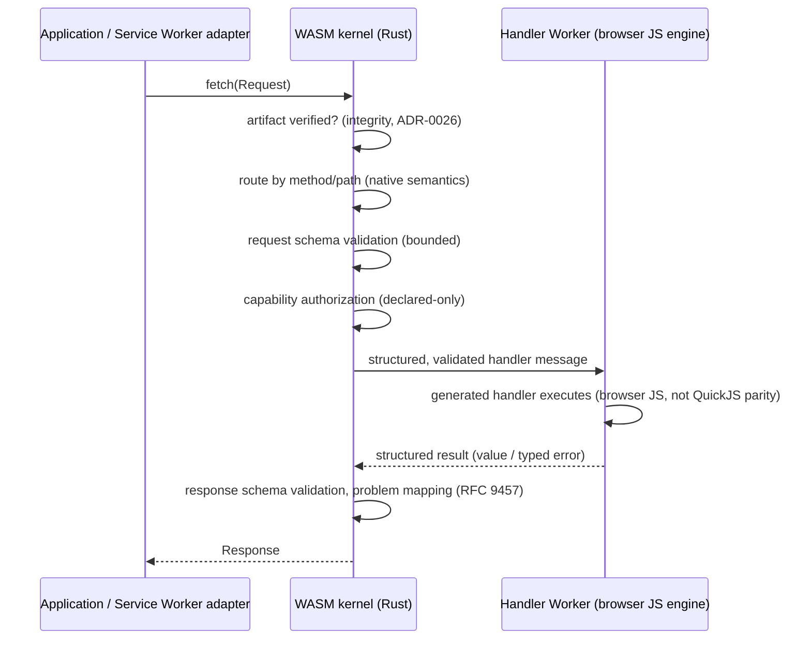

# ADR-0037: Browser-WASM Product and Runtime Contract

## Context

Velqu's native product is a Rust HTTP host embedding quickjs-ng in one
process (AGENTS.md constraints 1–14). A Browser-WASM target would let a
Velqu application (pack + generated handlers) run entirely client-side,
but the native runtime cannot be ported wholesale: the host depends on
tokio, libc-adjacent ingress, mmap-based pack loading
(`q-pack` → `memmap2`), and the native QuickJS engine.

Freezing the contract before any kernel implementation exists prevents
two recorded failure modes: drifting into a full port of native
`q-runtime`, or drifting into an unverified JavaScript-only
reimplementation that silently diverges from the native compatibility
surface.

The hybrid shape below was specified by the owner in the Browser-WASM
packet and is ratified here verbatim as the frozen contract.

## Decision

### 1. Profiles

| Profile | Status | Definition |
|---|---|---|
| **`browser-hybrid`** | **Frozen MVP contract** | Rust compiled to WebAssembly owns artifact verification, routing, request/response schema validation, compatibility checks, capability authorization, and problem mapping. Generated TypeScript handlers execute in an isolated browser Worker. The compiler stays native (Bun toolchain) for the MVP; deployed runtime execution is browser-local. |
| **`quickjs-wasm`** | **Experimental, behind a decision gate** | QuickJS-NG compiled to WASM as the in-browser handler engine, targeting handler-level parity. Not a release profile; requires a recorded owner decision (and BWASM-X-001 evidence) before it changes the release contract. |

### 2. Public runtime boundary

The canonical browser interface is:

```ts
fetch(request: Request): Promise<Response>
```

A Velqu browser runtime is an object with this boundary plus artifact
load/verification; everything else (Service Worker, preview server,
framework adapters) is an adapter over it. Service Workers are
**explicitly an adapter, not mandatory** for the beta contract.

### 3. Request lifecycle and ownership



Ownership is explicit at the two boundaries:

- **Before handler execution the WASM kernel owns everything**: pack
  integrity, route identity, request decoding and validation, capability
  authorization, and deadline/bounds decisions. The Worker never sees
  raw unvalidated bytes or undeclared capability authority.
- **After handler execution the kernel owns everything again**: the
  Worker returns a structured result; only the kernel validates it
  against the response schema, maps unexpected errors to redacted
  problems, and constructs the final `Response`.

The Worker is an execution island: it holds no artifact, no router, no
capability registry, and no authority beyond the single structured
message it is currently executing. Deadlines are enforced kernel-side
(termination via Worker termination + cold restart, per the recovery
model in BWASM-R-004's contract).

### 4. Artifact lifecycle

- One artifact class: the QPack artifact (formatVersion 1 semantics;
  ADR-0024/0025), produced by the **native** compiler. The compiler may
  remain native/Bun for the MVP; deployed runtime execution is
  browser-local.
- Verification in-browser is **integrity only** (in-band digests,
  fail-closed), identical in semantics to the native loader (ADR-0026);
  authenticity remains out-of-band deployment policy (served-over-HTTPS
  origin + deployment pipeline), never declared inside the artifact.
- Update model: whole-artifact replacement keyed by canonical content
  hash (ADR-0023); no in-place patching; a running runtime is not
  hot-swapped mid-request — new artifact, new kernel instance.
- Persistence: the WASM kernel has **no ambient filesystem**. Durable
  state exists only through explicit, declared browser-storage
  capabilities (namespaced IndexedDB KV is the frozen MVP persistence
  surface; anything beyond it is post-MVP).

### 5. Capability model

| Native capability | Browser contract class |
|---|---|
| Native `fetch` (SSRF-policy host bridge) | **Adapted** — browser `fetch` capability with declared allowlist policy enforced by the kernel before the handler sees it; no ambient authority, credentials excluded by default |
| Postgres (native pool) | **Deployment-required** — fail-closed typed problem in-browser; contract stays async so the browser surface can share it (BWASM-C-002) |
| Timers / crypto.getRandomValues / logging | **Adapted / browser-only** equivalents behind the same declared-capability ABI |
| Filesystem, native ingress, worker scaling | **Unsupported / native-only** — absent from the browser contract, not simulated |
| `defer` | **Adapted** — bounded, in-memory, Worker-side best-effort (never a durable queue; matches native honesty) |

The capability ABI, ready-gating, cancellation classes, and bounded
shutdown semantics are inherited unchanged from ADR-0028..0031; only the
transport (postMessage bridge) is adapted.

### 6. Package and crate boundaries

Grounded in the measured workspace graph (BWASM-D-002 evidence):

- **Portable target set** (compile to wasm32, semantics frozen here):
  byte-level QPack verification core (split from native `memmap2`
  loading — K-002), router core (split from tokio host — K-003),
  `q-schema-runtime` validation (K-004), capability authorization and
  problem mapping. These compose into a new **`q-browser-kernel`** crate
  exposing a message-based wasm-bindgen ABI (K-005).
- **Native-only** (never compiled to wasm32): `q-runtime` host (tokio,
  ingress, single/multi-worker scheduling), `q-engine-quickjs`
  (rquickjs native), pack loading via `memmap2`, native capabilities.
- **Browser runtime package**: `@velqu/browser-runtime` (TS) owns
  Worker lifecycle, the `fetch(Request)` dispatcher, artifact loading
  and hash-addressed caching, and the capability postMessage bridge.

### 7. Semantics classification (frozen vocabulary)

Every browser-visible semantic is classified exactly one of:

- **identical** — same bytes-in/bytes-out, same typed outcomes (routing
  identity, schema validation, pack integrity verification, problem
  shape, contract/lock artifacts);
- **adapted** — same contract, platform-corrected transport (capabilities
  over postMessage, fetch via browser stack, defer in-memory);
- **unsupported** — absent, with a typed fail-closed problem
  (native-only capabilities);
- **deployment-required** — available only behind the native runtime;
  declared in the artifact's capability manifest so the browser runtime
  can fail closed before request time;
- **explicitly simulated** — nothing. This class is defined so it can be
  empty and remain empty; any proposal to add a member is a new owner
  decision.

### 8. Engine honesty

Default Worker handlers execute on the browser's JavaScript engine.
They are **not QuickJS-NG engine parity**: numeric edge semantics,
stack depth limits, and engine-identical error message text are not
claimed. The `quickjs-wasm` experimental profile exists precisely to
make parity opt-in rather than accidental. Same-process (here: same-
Worker) code remains trusted application code — the browser origin
boundary, not this runtime, is the isolation boundary (extends
ADR-0035; the full threat model is BWASM-D-003's contract).

## Rejected alternatives

1. **Port `q-runtime` unchanged to wasm32** — rejected: tokio ingress,
   mmap, and native scheduling have no browser meaning; the port would
   be a fork wearing the same name, and every bounded-queue guarantee
   would need re-derivation on a different scheduler model.
2. **JavaScript-only runtime reimplementation** — rejected: the
   compatibility-critical surface (verification, routing, validation,
   capability authz) is exactly where silent divergence would hide; a
   JS rewrite cannot inherit the Rust test corpus without the Rust code.
3. **QuickJS-NG-in-WASM as the MVP default** — rejected for MVP: size
   and startup budgets (ratified in BWASM-D-004) and a second engine
   port before any browser kernel exists; retained as the experimental
   profile behind an explicit owner gate.
4. **Service-Worker-mandatory deployment** — rejected: forces every
   consumer into SW-capable hosting and makes the runtime harder to
   embed; the SW is an adapter over the frozen dispatcher.

## Non-goals and forbidden product claims

- Not a hostile-code sandbox: the browser runtime executes the
  application's own (possibly AI-generated) handler code; isolation of
  *untrusted preview code* is a deployment-mode concern specified in
  BWASM-D-003 (preview origin, sandboxed iframe), never a runtime
  claim.
- No PostgreSQL parity, no native-runtime performance parity, no
  universal size/startup claims without the BWASM-D-004 evidence
  procedures.
- "Runs in the browser" never implies "needs no hosting": static
  artifact hosting is still hosting (origin, TLS, cache policy remain
  deployment concerns — ADR-0026/0034 carry over).
- No ambient authority in handlers: every capability is declared,
  authorized kernel-side, and revocable at the boundary.

## Consequences

- The K-phase (BWASM-K-001..006) builds only inside the frozen
  boundaries; any boundary change reopens this ADR.
- Conformance work (BWASM-Q-001) can target the classification
  vocabulary directly: identical surfaces get differential tests,
  adapted surfaces get transport tests, unsupported surfaces get
  fail-closed tests.
- The K-phase gate remains CLOSED: the owner's instruction conditions
  kernel work on the four design decisions being frozen, and BWASM-D-004
  is BLOCKED on a missing owner decision record (ADR-0039 is
  `proposed`). The 33 unregistered kernel/runtime/build issues remain
  unregistered until the owner explicitly ratifies the design freeze.
- Status history: originally recorded as `accepted` with an overstated
  owner-acceptance claim; corrected to `proposed` on 2026-09-05; the
  owner ratified the full ADR (invariant + agent-authored remainder)
  later the same day. The design freeze is complete.
